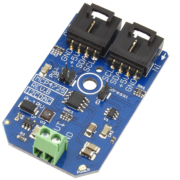

This library provides a class for the MCP4725, it relies on the ncd-red-comm library for communication, and includes a node-red node for the MCP4725. The MCP4725 is a low-power, high accuracy, single channel, 12-bit buffered voltage output Digital-to-Analog Convertor (DAC) with non-volatile memory (EEPROM). [Ncd.io](https://ncd.io) manufactures multiple mini-modules that utilize this chip for different applications. You can see a [list here](https://store.ncd.io/?fwpcache=all&fwp_chip_name=mcp4725).

[](https://store.ncd.io/?fwpcache=all&fwp_chip_name=mcp4725)

### Installation

This library can be installed with npm with the following command:

```
npm install ncd-red-mcp4725
```

For use in node-red, use the same command, but inside of your node-red directory (usually `~./node-red`).

### Usage

The `test.js` file included in this library contains basic examples for use.  All of the available configurations are available in the node-red node through the UI.

### Raspberry Pi Notes

If you intend to use this on the Raspberry Pi, you must ensure that:
1. I2C is enabled (there are plenty of tutorials on this that differ based on the Pi version.)
2. Node, NPM, and Node-red should be updated to the latest stable versions. If you skip this step the ncd-red-comm dependency may not load properly.
